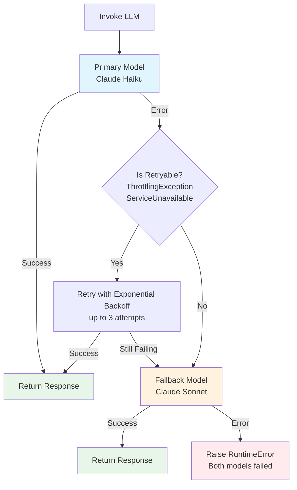

# Model Failover and Resilience

This document describes the model resilience logic implemented in the LangGraph agent for handling Bedrock API errors with automatic retry and failover capabilities.

## Overview

The agent uses a `ResilientLLMInvoker` class that provides:

1. **Retry with exponential backoff** for transient errors on the primary model
2. **Immediate failover** to a secondary model for model-specific errors
3. **Graceful error handling** when both models fail



## Configuration

The resilience logic is configured in `langgraph_agent_web_search.py`:

```python
resilient_llm = ResilientLLMInvoker(
    primary_llm_with_tools=llm_primary_with_tools,      # Claude Haiku (global)
    fallback_llm_with_tools=llm_fallback_with_tools,    # Claude Sonnet (global)
    max_retries=3,           # Number of retry attempts
    min_wait_seconds=1.0,    # Minimum wait between retries
    max_wait_seconds=10.0,   # Maximum wait between retries
)
```

### Environment Variables

| Variable | Default | Description |
|----------|---------|-------------|
| `MODEL_ID` | `global.anthropic.claude-haiku-4-5-20251001-v1:0` | Primary model (faster, cheaper) |
| `FALLBACK_MODEL_ID` | `global.anthropic.claude-sonnet-4-5-20250929-v1:0` | Fallback model (more capable) |

The `global.` prefix uses [Global Cross-Region Inference](https://docs.aws.amazon.com/bedrock/latest/userguide/global-cross-region-inference.html), which automatically routes requests to the optimal AWS region worldwide for maximum throughput.

## Error Classification

Errors are classified into three categories based on their error codes:

### 1. Retryable Errors

These errors trigger automatic retry with exponential backoff on the **same model**:

| Error Code | HTTP Status | Description | AWS Recommendation |
|------------|-------------|-------------|-------------------|
| `ThrottlingException` | 429 | Account quota exceeded | Retry with exponential backoff |
| `ServiceUnavailable` | 503 | Service temporarily unavailable | Retry with exponential backoff |
| `InternalFailure` | 500 | Server-side error | Retry with exponential backoff |
| `ServiceException` | 500 | General service error | Retry with exponential backoff |
| `RequestTimeout` | 408 | Request processing timeout | Retry with exponential backoff |

**Reference:** [Troubleshooting Amazon Bedrock API Error Codes](https://docs.aws.amazon.com/bedrock/latest/userguide/troubleshooting-api-error-codes.html)

### 2. Fallback-Triggering Errors

These errors trigger **immediate failover** to the secondary model (no retry):

| Error Code | HTTP Status | Description | Why Immediate Failover |
|------------|-------------|-------------|----------------------|
| `ModelNotReadyException` | 429 | Model not ready for inference | Model-specific issue; different model may work |
| `ModelStreamErrorException` | 424 | Error during streaming response | Model processing issue |
| `ModelTimeoutException` | 408 | Model took too long to respond | Try a different model |
| `ModelErrorException` | 424 | Error while processing the model | Model-specific failure |
| `ServiceQuotaExceededException` | 429 | Service quota exhausted | Quota is per-model; fallback model has separate quota |

**Reference:** [Converse API Errors](https://docs.aws.amazon.com/bedrock/latest/APIReference/API_runtime_Converse.html#API_runtime_Converse_Errors)

### 3. Non-Retryable Errors

These errors are **not retried** and result in immediate failure:

| Error Code | HTTP Status | Description | Resolution |
|------------|-------------|-------------|------------|
| `AccessDeniedException` | 403 | Insufficient IAM permissions | Fix IAM policy |
| `ValidationException` | 400 | Invalid input parameters | Fix request payload |
| `ResourceNotFoundException` | 404 | Model or resource not found | Check model ID |

## Retry Strategy

The retry mechanism uses [tenacity](https://tenacity.readthedocs.io/) with exponential backoff:

```python
@retry(
    retry=retry_if_exception(is_retryable_error),
    stop=stop_after_attempt(3),
    wait=wait_exponential(multiplier=1, min=1.0, max=10.0),
    reraise=True,
)
```

### Backoff Timing

| Attempt | Wait Time |
|---------|-----------|
| 1st retry | ~1 second |
| 2nd retry | ~2 seconds |
| 3rd retry | ~4 seconds (capped at 10s) |

AWS recommends adding [jitter](https://aws.amazon.com/builders-library/timeouts-retries-and-backoff-with-jitter/) to prevent thundering herd issues. The `tenacity` library's `wait_exponential` includes randomization.

**Reference:** [Retry behavior - AWS SDKs and Tools](https://docs.aws.amazon.com/sdkref/latest/guide/feature-retry-behavior.html)

## Cross-Region Inference

The agent uses **Global Cross-Region Inference** profiles for both models:

```
global.anthropic.claude-haiku-4-5-20251001-v1:0
global.anthropic.claude-sonnet-4-5-20250929-v1:0
```

### Benefits

| Feature | Geographic | Global |
|---------|------------|--------|
| Data residency | Within geographic boundaries | Any AWS region worldwide |
| Throughput | Higher than single-region | **Highest available** |
| Cost | Standard pricing | **~10% savings** |

### How It Works

1. Request is sent to your configured region (e.g., `us-east-2`)
2. Bedrock automatically routes to the optimal region with capacity
3. Response is returned through the same path
4. All data remains on the AWS network (encrypted in transit)

**Reference:** [Increase throughput with cross-Region inference](https://docs.aws.amazon.com/bedrock/latest/userguide/cross-region-inference.html)

## Logging

The resilience logic logs key events for observability:

```
INFO  - Chatbot node invoked with 1 messages
WARN  - Primary model failed after retries: ThrottlingException. Falling back to secondary model.
INFO  - Using fallback model due to primary model failure: ...
INFO  - Fallback model invocation successful
INFO  - Response generated using fallback model
```

When using OpenTelemetry instrumentation (enabled in the deployed container), these logs are correlated with traces in AWS X-Ray.

## Code Reference

The resilience logic is implemented in `langgraph_agent_web_search.py`:

- **Lines 44-50**: `RETRYABLE_ERROR_CODES` - Set of error codes that trigger retry
- **Lines 53-59**: `FALLBACK_ERROR_CODES` - Set of error codes that trigger immediate fallback
- **Lines 62-67**: `is_retryable_error()` - Function to check if an error should be retried
- **Lines 70-75**: `should_fallback()` - Function to check if an error should trigger fallback
- **Lines 78-159**: `ResilientLLMInvoker` - Class implementing the retry and fallback logic

## Testing

Unit tests for the resilience logic are in `tests/test_agent.py`:

```bash
# Run all resilience tests
make test

# Run specific test classes
uv run pytest tests/test_agent.py::TestExceptionClassification -v
uv run pytest tests/test_agent.py::TestResilientLLMInvoker -v
```

### Test Coverage

- `TestExceptionClassification`: Verifies error code classification
  - `test_throttling_is_retryable`
  - `test_service_unavailable_is_retryable`
  - `test_model_not_ready_triggers_fallback`
  - `test_quota_exceeded_triggers_fallback`
  - `test_access_denied_not_retryable`

- `TestResilientLLMInvoker`: Verifies retry and fallback behavior
  - `test_successful_primary_invocation`
  - `test_fallback_on_non_retryable_error`
  - `test_retry_then_success`
  - `test_fallback_after_max_retries`
  - `test_both_models_fail`

## AWS Documentation References

- [Troubleshooting Amazon Bedrock API Error Codes](https://docs.aws.amazon.com/bedrock/latest/userguide/troubleshooting-api-error-codes.html)
- [Converse API Reference](https://docs.aws.amazon.com/bedrock/latest/APIReference/API_runtime_Converse.html)
- [InvokeModel API Reference](https://docs.aws.amazon.com/bedrock/latest/APIReference/API_runtime_InvokeModel.html)
- [Quotas for Amazon Bedrock](https://docs.aws.amazon.com/bedrock/latest/userguide/quotas.html)
- [Cross-Region Inference](https://docs.aws.amazon.com/bedrock/latest/userguide/cross-region-inference.html)
- [Global Cross-Region Inference](https://docs.aws.amazon.com/bedrock/latest/userguide/global-cross-region-inference.html)
- [Retry behavior - AWS SDKs and Tools](https://docs.aws.amazon.com/sdkref/latest/guide/feature-retry-behavior.html)
- [Timeouts, retries, and backoff with jitter](https://aws.amazon.com/builders-library/timeouts-retries-and-backoff-with-jitter/)
