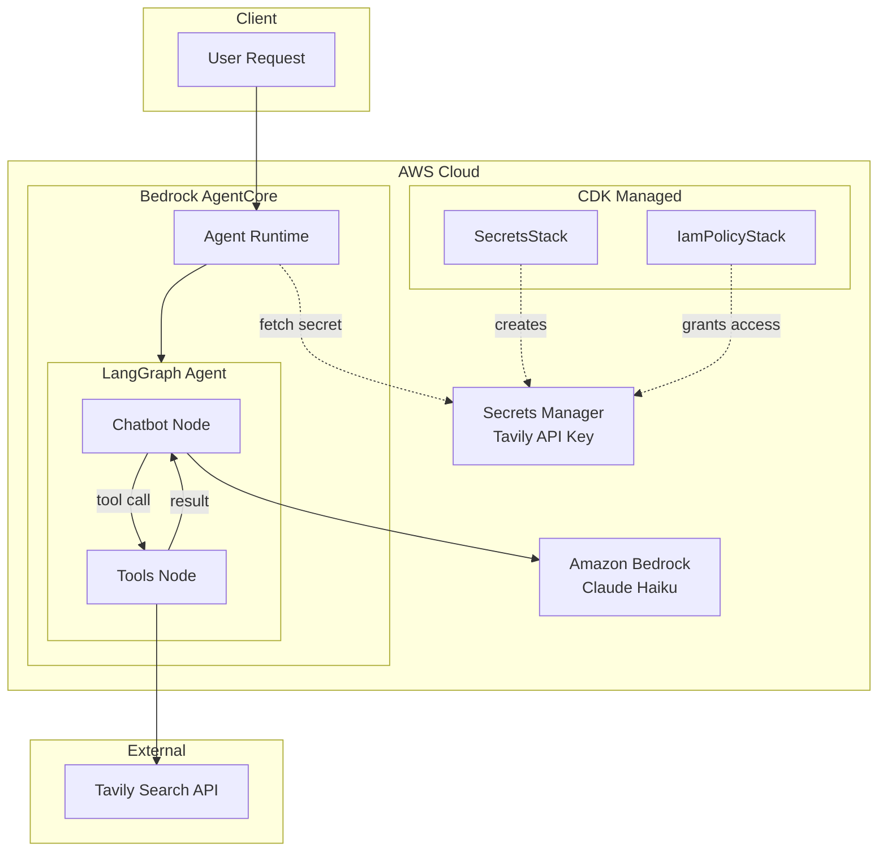

# LangGraph Agent on AWS Bedrock AgentCore

A sample LangGraph agent with web search capabilities deployed to AWS Bedrock AgentCore. This project demonstrates how to build and deploy a LangGraph-based AI agent with full observability (LLM calls, tool calls, and timing metrics) using AWS native tooling.

## What This Project Does

This agent:

- Uses **Claude Haiku** (via Amazon Bedrock) as the LLM
- Performs **web searches** using the Tavily API
- Runs on **AWS Bedrock AgentCore** with container deployment
- Provides **full observability** via OpenTelemetry instrumentation (LangChain traces, LLM latency, tool execution times)

## Architecture



The agent uses a ReAct-style graph where the **Chatbot Node** invokes Claude Haiku, and if a tool call is requested, the **Tools Node** executes the Tavily search and returns results back to the chatbot.

## Prerequisites

**Local tools:**
- **Python 3.13+**
- **uv** - Fast Python package manager. Install with `curl -LsSf https://astral.sh/uv/install.sh | sh`
- **Node.js** - Required for AWS CDK CLI

**AWS tools:**
- **AWS CLI** - Configured with credentials (default profile or named profile)
- **AWS CDK CLI** - Install with `npm install -g aws-cdk`

**Accounts & API keys:**
- **AWS Account** with permissions for Bedrock AgentCore, IAM, ECR, S3, CodeBuild, Secrets Manager, CloudWatch Logs, and CloudFormation
- **Tavily API Key** - Get one at <https://tavily.com>

> **Note on AWS Credentials:** Commands below show two options:
>
> - **Default credentials**: Use if you have `~/.aws/credentials` configured or are using environment variables
> - **Named profile**: Use if you have SSO or multiple profiles configured (replace `YourProfileName` with your profile)

## Setup

### 1. Clone the Repository

```bash
git clone <repository-url>
cd langgraph-to-agentcore-sample
```

### 2. Install Dependencies

This project uses [uv](https://docs.astral.sh/uv/) for fast, reliable dependency management.

```bash
# Using Makefile (recommended)
make setup

# Or using uv directly
uv sync --extra deploy
```

> **Note:** No need to manually activate a virtual environment. Use `uv run <command>` or `make <target>` to run commands with the correct environment.

### 3. Configure Environment Variables

Create a `.env` file from the sample:

```bash
cp .env.sample .env
```

Edit `.env` with your configuration:

```bash
# Required - API Keys
TAVILY_API_KEY=your-tavily-api-key-here

# Deployment Configuration
AWS_REGION=us-east-2
AGENT_NAME=langgraph_agent_web_search
MODEL_ID=global.anthropic.claude-haiku-4-5-20251001-v1:0
FALLBACK_MODEL_ID=global.anthropic.claude-sonnet-4-5-20250929-v1:0
SECRET_NAME=langgraph-agent/tavily-api-key
```

| Variable            | Description                                                              |
| ------------------- | ------------------------------------------------------------------------ |
| `TAVILY_API_KEY`    | Your Tavily API key (required)                                           |
| `AWS_REGION`        | AWS region for deployment (default: `us-east-2`)                         |
| `AGENT_NAME`        | Name for your agent in AgentCore (keep under 25 chars to avoid AWS limits) |
| `MODEL_ID`          | Primary Bedrock model ID (default: Haiku)                                |
| `FALLBACK_MODEL_ID` | Fallback model when primary is unavailable (default: Sonnet)             |
| `SECRET_NAME`       | Name for the Secrets Manager secret                                      |

### 4. Ensure AWS Credentials are Active

```bash
# For SSO profiles
aws sso login --profile YourProfileName

# For default credentials, verify with:
aws sts get-caller-identity
```

## Running Tests

Before deploying, run the test suite to verify everything works:

```bash
# Using Makefile (recommended)
make test          # Run all tests
make test-cov      # Run with coverage report

# Or using uv directly
uv run pytest tests/ -v
```

The test suite includes:
- **Agent tests** (`tests/test_agent.py`): Tests for secret fetching, payload handling, resilience logic, and state management
- **Agent function tests** (`tests/test_agent_functions.py`): Unit tests for agent functions including chatbot node, invocation handling, and error cases
- **CDK tests** (`tests/test_cdk.py`): Infrastructure tests for Secrets Manager and IAM policy stacks

## Deployment

### Using the Deploy Script (Required)

The deployment script is **required** because it passes runtime environment variables to the AgentCore container via `--env` flags. Without this step, the agent would use hardcoded defaults instead of your `.env` configuration.

```bash
# Using Makefile (recommended)
make deploy                          # Default credentials
make deploy PROFILE=YourProfileName  # Named profile (SSO users)

# Or using uv directly
uv run python -m scripts.deploy                          # Default credentials
uv run python -m scripts.deploy --profile YourProfileName # Named profile (SSO users)
```

**What the script does:**

| Step | Action                                                                          |
| ---- | ------------------------------------------------------------------------------- |
| 1/6  | **CDK SecretsStack** - Deploys Secrets Manager secret via AWS CDK               |
| 2/6  | **Configure** - Runs `agentcore configure` to generate Dockerfile               |
| 3/6  | **Deploy** - Builds container via CodeBuild, passes env vars via `--env` flags  |
| 4/6  | **Extract Role** - Gets execution role ARN from `.bedrock_agentcore.yaml`       |
| 5/6  | **CDK IamPolicyStack** - Grants Secrets Manager access via AWS CDK              |
| 6/6  | **Restart Containers** - Redeploys to apply IAM permissions to running containers |

> **Infrastructure as Code:** This project uses AWS CDK to manage Secrets Manager secrets and IAM policies. CDK provides version-controlled, reviewable infrastructure that integrates with your team's workflow.
>
> **How environment variables are passed:** The script uses `agentcore deploy --env` flags to pass `AWS_REGION`, `SECRET_NAME`, `MODEL_ID`, and `FALLBACK_MODEL_ID` to the container runtime. This approach is cleaner than modifying the Dockerfile.
>
> **First-time setup:** The deploy script automatically bootstraps CDK if needed (one-time per account/region).

### Manual Deployment (Advanced)

<!-- markdownlint-disable MD033 -->
<details>
<summary>Click to expand manual deployment steps</summary>
<!-- markdownlint-enable MD033 -->

> **Warning:** Manual deployment requires you to pass environment variables via `--env` flags when running `agentcore deploy`. If you skip this step, the agent will use hardcoded defaults instead of your configuration. **Using the deploy script (`make deploy`) is strongly recommended.**

#### 1. Create Secrets Manager Secret

```bash
# Using default credentials
aws secretsmanager create-secret \
  --name "langgraph-agent/tavily-api-key" \
  --secret-string "your-tavily-api-key-here" \
  --region <your-region>

# Using a named profile
aws secretsmanager create-secret \
  --name "langgraph-agent/tavily-api-key" \
  --secret-string "your-tavily-api-key-here" \
  --region <your-region> \
  --profile YourProfileName
```

#### 2. Configure the Agent

```bash
# Using default credentials
uv run agentcore configure \
  -e langgraph_agent_web_search.py \
  -n langgraph_agent_web_search \
  -dt container \
  -r <your-region> \
  --non-interactive

# Using a named profile
AWS_PROFILE=YourProfileName uv run agentcore configure \
  -e langgraph_agent_web_search.py \
  -n langgraph_agent_web_search \
  -dt container \
  -r <your-region> \
  --non-interactive
```

**Arguments explained:**

| Flag                     | Description                                                                                                                                                     |
| ------------------------ | --------------------------------------------------------------------------------------------------------------------------------------------------------------- |
| `-e, --entrypoint`       | The Python file containing your agent code and the `@app.entrypoint` decorator                                                                                  |
| `-n, --name`             | Unique name for your agent (used in ARNs, ECR repo names, and CloudWatch logs)                                                                                  |
| `-dt, --deployment-type` | Either `container` or `direct_code_deploy`. Use `container` for proper OpenTelemetry instrumentation—wraps code with `opentelemetry-instrument` in Dockerfile   |
| `-r, --region`           | AWS region to deploy to (must have Bedrock AgentCore available)                                                                                                 |
| `--non-interactive`      | Skip interactive prompts; use defaults for unspecified options (useful for CI/CD)                                                                               |

> **Why `container` mode?** The `direct_code_deploy` mode runs your Python file directly without the `opentelemetry-instrument` wrapper. Container mode generates a Dockerfile with `CMD ["opentelemetry-instrument", "python", "-m", "your_agent"]`, which auto-instruments LangChain, Bedrock, and other libraries for tracing.

#### 3. Deploy the Agent

Pass environment variables via `--env` flags:

```bash
# Using default credentials
uv run agentcore deploy \
  --env "AWS_REGION=<your-region>" \
  --env "SECRET_NAME=langgraph-agent/tavily-api-key" \
  --env "MODEL_ID=global.anthropic.claude-haiku-4-5-20251001-v1:0"

# Using a named profile
AWS_PROFILE=YourProfileName uv run agentcore deploy \
  --env "AWS_REGION=<your-region>" \
  --env "SECRET_NAME=langgraph-agent/tavily-api-key" \
  --env "MODEL_ID=global.anthropic.claude-haiku-4-5-20251001-v1:0"
```

#### 4. Grant Secrets Manager Access

```bash
# Get the execution role name from .bedrock_agentcore.yaml
ROLE_NAME=$(grep "execution_role:" .bedrock_agentcore.yaml | head -1 | sed 's/.*role\///' | tr -d ' ')

# Using default credentials
aws iam put-role-policy \
  --role-name "$ROLE_NAME" \
  --policy-name SecretsManagerAccess \
  --policy-document '{
    "Version": "2012-10-17",
    "Statement": [
      {
        "Effect": "Allow",
        "Action": ["secretsmanager:GetSecretValue"],
        "Resource": "arn:aws:secretsmanager:<your-region>:*:secret:langgraph-agent/*"
      }
    ]
  }' \
  --region <your-region>

# Using a named profile
aws iam put-role-policy \
  --role-name "$ROLE_NAME" \
  --policy-name SecretsManagerAccess \
  --policy-document '{
    "Version": "2012-10-17",
    "Statement": [
      {
        "Effect": "Allow",
        "Action": ["secretsmanager:GetSecretValue"],
        "Resource": "arn:aws:secretsmanager:<your-region>:*:secret:langgraph-agent/*"
      }
    ]
  }' \
  --region <your-region> \
  --profile YourProfileName
```

</details>

## Testing the Deployed Agent

### Web UI (Recommended)

A NiceGUI-based web interface is available for testing the deployed agent with multiple prompts concurrently:

```bash
# Launch the testing UI
make ui
```

Then open http://localhost:8080 in your browser.

**Features:**

| Feature | Description |
|---------|-------------|
| **Prompt Library** | Pre-configured library of 15 test prompts across different categories |
| **Concurrent Execution** | Run multiple prompts in parallel (configurable 1-10 concurrent) |
| **AWS Profile Selection** | Dropdown populated from `~/.aws/config` |
| **Real-time Progress** | Live progress bar and status counters |
| **Results View** | Expandable results with full response text |
| **CSV Export** | Export all results to CSV for analysis |
| **CRUD Operations** | Add, edit, and delete prompts from the library |

**UI Layout:**

```text
┌─────────────────────────────────────────────────────────────────┐
│  AgentCore Testing Dashboard                      [Dark Mode]   │
├────────────────────────────┬────────────────────────────────────┤
│  Prompt Library            │  Execution                         │
│  ┌──────────────────────┐  │  AWS Profile: [PowerUser    ▼]    │
│  │ □ AWS News      tech │  │  Concurrent:  ═══●═══════  3      │
│  │ □ Weather      gen   │  │  Timeout:     [120] sec           │
│  │ □ Simple Test  test  │  │                                   │
│  │ ...                  │  │  [Run Selected] [Run All]         │
│  └──────────────────────┘  │  Progress: ████████░░ 8/10        │
│  [Add] [Delete]            │  ✓ 6 success  ✗ 2 failed          │
│  [Select All] [None]       │                                   │
├────────────────────────────┴────────────────────────────────────┤
│  Results                                    [Export CSV] [Clear]│
│  ┌──────────────────────────────────────────────────────────────┤
│  │ ✓ AWS News        12.3s  [▼]                                │
│  │ ✓ Weather Query    8.1s  [▼]                                │
│  │ ✗ Stock Price      4.2s  [▼] Error: timeout                 │
│  └──────────────────────────────────────────────────────────────┘
└─────────────────────────────────────────────────────────────────┘
```

**Prompt Storage:** Prompts are stored in `ui/prompts.json` and persist across sessions.

### Invoke the Agent

```bash
# Using Makefile (recommended)
make invoke PROFILE=YourProfileName                          # Default prompt
make invoke PROFILE=YourProfileName PROMPT="Your question"   # Custom prompt

# Using uv directly
uv run agentcore invoke '{"prompt": "Search for AWS news today"}'
AWS_PROFILE=YourProfileName uv run agentcore invoke '{"prompt": "Search for AWS news today"}'
```

### View Logs

First, get the log group from `agentcore status`, then use AWS CLI:

```bash
# Get the log group name and tail command
make status PROFILE=YourProfileName

# Then tail logs using the log group shown in status output
aws logs tail /aws/bedrock-agentcore/runtimes/<agent-id>-DEFAULT \
  --log-stream-name-prefix "$(date +%Y/%m/%d)/[runtime-logs]" \
  --follow --profile YourProfileName
```

### Check Agent Status

```bash
# Using Makefile
make status PROFILE=YourProfileName

# Using uv directly
uv run agentcore status
AWS_PROFILE=YourProfileName uv run agentcore status
```

## Observability

This project uses OpenTelemetry instrumentation to capture LangChain traces. The container deployment uses the `opentelemetry-instrument` wrapper which auto-instruments:

- **LangChain/LangGraph** operations (chains, tools, routing)
- **Bedrock Runtime** API calls (LLM invocations)
- **Botocore** AWS SDK calls

### View Traces

List recent traces:

```bash
# Using Makefile
make traces PROFILE=YourProfileName

# Using uv directly
uv run agentcore obs list
AWS_PROFILE=YourProfileName uv run agentcore obs list
```

Show detailed trace with timing:

```bash
uv run agentcore obs show --last 1 --verbose
AWS_PROFILE=YourProfileName uv run agentcore obs show --last 1 --verbose
```

Example output:

```text
🔍 Trace: 694561e74067881e... (6 spans, 4293.24ms)
├── ⚠ chatbot.task [1197.63ms]
│   ├── ⚠ ChatBedrockConverse.chat [1196.88ms]
│   │   └── ⚠ chat claude-haiku [1192.09ms]
│   └── ⚠ tools_condition.task [0.24ms]
└── ⚠ tools.task [3095.05ms]
    └── ⚠ tavily_search_results_json.tool [3093.94ms]
```

### CloudWatch Dashboard

View the GenAI Observability Dashboard in the AWS Console:

```text
https://console.aws.amazon.com/cloudwatch/home?region=<your-region>#gen-ai-observability/agent-core
```

## Project Structure

```text
.
├── langgraph_agent_web_search.py  # Main agent code
├── resilience.py                  # Retry and fallback logic
├── Makefile                       # Common development commands
├── pyproject.toml                 # Project metadata and dependencies
├── uv.lock                        # Locked dependencies (uv)
├── .env.sample                    # Environment variable template
├── .env                           # Local environment variables (gitignored)
├── .gitignore                     # Git ignore rules
├── scripts/                       # Deployment scripts (Python/Typer)
│   ├── deploy.py                  # Deploy to AWS Bedrock AgentCore
│   ├── destroy.py                 # Cleanup AWS resources
│   └── lib/                       # Shared utilities
│       ├── aws.py                 # boto3 helpers (CloudFormation, Secrets, ECR)
│       ├── commands.py            # Subprocess wrappers (agentcore, cdk)
│       ├── config.py              # .env loading and validation
│       ├── console.py             # Colored output (Rich)
│       └── yaml_parser.py         # Parse .bedrock_agentcore.yaml
├── cdk/                           # AWS CDK infrastructure code
│   ├── app.py                     # CDK app entry point
│   ├── cdk.json                   # CDK configuration
│   └── stacks/                    # CDK stack definitions
│       ├── __init__.py            # Stack exports
│       ├── constants.py           # Shared constants
│       ├── secrets_stack.py       # Secrets Manager resources
│       └── iam_stack.py           # IAM policies
├── ui/                            # NiceGUI testing web application
│   ├── app.py                     # Main application entry point
│   ├── prompts.json               # Prompt library storage (generated)
│   ├── components/                # UI components
│   │   ├── prompt_library.py      # Prompt list with CRUD
│   │   ├── execution_panel.py     # Run controls and progress
│   │   └── results_view.py        # Results table with export
│   └── lib/                       # Application logic
│       ├── models.py              # Data models (Prompt, Config, Result)
│       ├── prompt_store.py        # JSON-based prompt persistence
│       ├── agent_invoker.py       # Async agent invocation wrapper
│       └── aws_config.py          # AWS profile detection
├── tests/                         # Test suite
│   ├── test_agent.py              # Agent unit tests
│   ├── test_agent_functions.py    # Agent function unit tests
│   └── test_cdk.py                # CDK infrastructure tests
├── .bedrock_agentcore.yaml        # Agent configuration (generated)
└── .bedrock_agentcore/            # Build artifacts (generated)
    └── langgraph_agent_web_search/
        └── Dockerfile             # Container definition
```

## Key Dependencies

| Package                                   | Purpose                        |
| ----------------------------------------- | ------------------------------ |
| `langgraph`                               | Agent graph framework          |
| `langchain`                               | LLM abstraction layer          |
| `langchain-aws`                           | Bedrock integration            |
| `langchain-community`                     | Tavily search tool             |
| `tavily-python`                           | Tavily API client              |
| `bedrock-agentcore`                       | AgentCore runtime SDK          |
| `bedrock-agentcore-starter-toolkit`       | CLI tools                      |
| `opentelemetry-instrumentation-langchain` | LangChain tracing              |
| `aws-opentelemetry-distro`                | AWS OTEL distribution          |
| `aws-cdk-lib`                             | AWS CDK infrastructure library |
| `constructs`                              | CDK constructs library         |
| `nicegui`                                 | Web UI for testing (optional)  |
| `pytest`                                  | Testing framework              |

## Makefile Commands

A Makefile is provided for common operations. Run `make help` to see all available targets. All commands use `uv` under the hood.

### Setup & Testing

```bash
make setup         # Install dependencies with uv sync
make test          # Run all tests
make test-cov      # Run tests with coverage report
make lint          # Run linter and format check (ruff)
make format        # Format code and fix lint issues (ruff)
```

### Deployment & Operations

```bash
make deploy PROFILE=YourProfile      # Deploy agent to AWS
make destroy PROFILE=YourProfile     # Destroy agent only (keeps secret and ECR)
make destroy-all PROFILE=YourProfile # Destroy all resources including secret and ECR
```

### Runtime Commands

```bash
make status PROFILE=YourProfile                 # Check agent status (includes log group info)
make invoke PROFILE=YourProfile                 # Test with default prompt
make invoke PROFILE=YourProfile PROMPT="Hello"  # Test with custom prompt
make logs PROFILE=YourProfile                   # Show how to tail agent logs
make traces PROFILE=YourProfile                 # List recent traces
make ui                                         # Launch web UI for testing (localhost:8080)
```

### Cleanup

```bash
make clean         # Remove build artifacts and cache files (.venv, __pycache__, cdk.out)
```

> **Note:** The `PROFILE` argument is optional. Omit it to use default AWS credentials.

## Customizing the Agent

### Adding a New Tool

To add a new tool to the agent:

1. **Install the tool package** (if needed):

   ```bash
   uv add langchain-some-tool
   ```

2. **Import and configure the tool** in `langgraph_agent_web_search.py`:

   ```python
   from langchain_community.tools import SomeTool

   # After the Tavily search definition
   some_tool = SomeTool(param="value")
   tools = [search, some_tool]  # Add to tools list
   ```

3. **Redeploy**:

   ```bash
   make deploy PROFILE=YourProfile
   ```

### Changing the LLM Model

Update `MODEL_ID` and `FALLBACK_MODEL_ID` in `.env` to use different Bedrock models:

```bash
# Primary model (default: Haiku - faster, lower cost)
MODEL_ID=global.anthropic.claude-haiku-4-5-20251001-v1:0

# Fallback model (default: Sonnet - used when primary is unavailable)
FALLBACK_MODEL_ID=global.anthropic.claude-sonnet-4-5-20250929-v1:0
```

**Model Fallback Behavior:**
- The agent retries the primary model up to 3 times with exponential backoff on throttling/service errors
- If retries are exhausted, it automatically falls back to the secondary model
- Both models have the same tools bound for consistent behavior

**Error Handling Strategy:**

| Error Type | Behavior | Rationale |
|------------|----------|-----------|
| `ThrottlingException` | Retry 3x with backoff | Temporary rate limit, may clear |
| `ServiceUnavailable` | Retry 3x with backoff | Transient service issue |
| `InternalFailure` | Retry 3x with backoff | Transient server error |
| `ServiceQuotaExceededException` | Immediate fallback | Quota exhausted, won't recover soon |
| `ModelNotReadyException` | Immediate fallback | Model unavailable in region |
| `ModelTimeoutException` | Immediate fallback | Model overloaded |
| `AccessDeniedException` | Fail (no fallback) | IAM issue, fallback would fail too |
| `ValidationException` | Fail (no fallback) | Bad input, would fail on any model |

### Adjusting Search Results

Modify `max_results` in `langgraph_agent_web_search.py`:

```python
search = TavilySearchResults(max_results=5)  # Default is 3
```

## Cost Estimation

Running this agent incurs costs from multiple AWS services:

| Service | Cost Factor | Estimate |
|---------|-------------|----------|
| **Bedrock (Claude Haiku)** | ~$0.25/1M input tokens, ~$1.25/1M output tokens | ~$0.001-0.01 per invocation |
| **Tavily API** | Free tier: 1000 searches/month | $0 (free tier) or $50+/month |
| **AgentCore Runtime** | Compute time | Varies by usage |
| **Secrets Manager** | $0.40/secret/month + $0.05/10K API calls | ~$0.50/month |
| **ECR** | $0.10/GB/month storage | ~$0.05/month |
| **CloudWatch Logs** | $0.50/GB ingested | ~$0.10/month (low usage) |

**Estimated monthly cost for light usage (100 invocations/month):** $1-5

> **Tip:** Use `agentcore obs list` to monitor invocation patterns and optimize costs.

## Security Considerations

### Secrets Management

- **API keys** are stored in AWS Secrets Manager, not in code or environment variables
- The agent fetches secrets at runtime using IAM role permissions
- Secrets have `RETAIN` removal policy to prevent accidental deletion

### IAM Least Privilege

- The execution role only has `secretsmanager:GetSecretValue` permission
- Access is scoped to the specific secret ARN (no wildcards)
- CDK validates ARN formats before deployment

### Network Security

- Agent runs in AWS-managed VPC (AgentCore infrastructure)
- Outbound internet access required for Tavily API calls
- All AWS API calls use HTTPS

### Container Security

- Container images are stored in ECR but **not actively scanned** for vulnerabilities
- Enable ECR scanning for production deployments:
  ```bash
  # Enable scan-on-push for the agent's ECR repository
  aws ecr put-image-scanning-configuration \
      --repository-name bedrock-agentcore-<agent_name> \
      --image-scanning-configuration scanOnPush=true \
      --region <your-region>
  ```
- For continuous scanning, consider enabling [Amazon Inspector](https://docs.aws.amazon.com/inspector/latest/user/scanning-ecr.html) enhanced scanning

### Recommendations

1. **Rotate secrets regularly** using Secrets Manager rotation
2. **Monitor CloudWatch logs** for unusual activity
3. **Use separate AWS accounts** for dev/staging/production
4. **Enable CloudTrail** to audit API calls

## Cleanup

Use the cleanup script to destroy AWS resources:

```bash
# Using Makefile (recommended)
make destroy PROFILE=YourProfile     # Destroy agent only (keeps secret and ECR)
make destroy-all PROFILE=YourProfile # Destroy everything

# Or using uv directly
uv run python -m scripts.destroy                          # Destroy agent only
uv run python -m scripts.destroy --profile YourProfileName # With named profile
uv run python -m scripts.destroy --all                    # Destroy everything

# Selective deletion flags
uv run python -m scripts.destroy --delete-secret              # Also delete Secrets Manager secret
uv run python -m scripts.destroy --delete-ecr                 # Also delete ECR repository
uv run python -m scripts.destroy --delete-secret --delete-ecr # Same as --all
```

**What gets deleted:**

| Flag              | Resources Removed                                                                             |
| ----------------- | --------------------------------------------------------------------------------------------- |
| *(default)*       | CDK IamPolicyStack, AgentCore agent, endpoint, memory, IAM roles, S3 artifacts, ECR images    |
| `--delete-secret` | + CDK SecretsStack + Secrets Manager secret                                                   |
| `--delete-ecr`    | + ECR repository                                                                              |
| `--all`           | Everything above                                                                              |

> **Tip:** For iterative development, use `make destroy` without the `-all` suffix. This preserves your secret and ECR repo, making redeployment faster since these don't need to be recreated.
>
> **Note:** The destroy script uses AWS CloudFormation directly to delete CDK stacks, so you don't need the CDK CLI installed for cleanup.

## Troubleshooting

### "agentcore command not found"

Use `uv run` or `make` to run commands with the correct environment:

```bash
# Using make (recommended)
make status PROFILE=YourProfile

# Or using uv directly
uv run agentcore status
```

If dependencies aren't installed, run `uv sync --extra deploy` first.

### Agent fails to start with "TAVILY_API_KEY not found"

Ensure:

1. The secret exists in Secrets Manager with the correct name
2. The execution role has the `SecretsManagerAccess` policy attached

### Traces not appearing in `agentcore obs list`

1. Wait 1-2 minutes after invocation for traces to propagate
2. Verify deployment type is `container` (not `direct_code_deploy`)
3. Check the OTEL logs: `aws logs tail <log-group> --log-stream-names "otel-rt-logs"`

### CodeBuild fails

Check CodeBuild logs in the AWS Console:

1. Go to **AWS CodeBuild** > **Build projects**
2. Find the project named `bedrock-agentcore-<agent-name>-builder`
3. Click on the failed build to view logs

### CDK deployment fails

If you see CDK-related errors:

1. **"CDK CLI not found"** - Install with `npm install -g aws-cdk`
2. **Bootstrap errors** - The deploy script auto-bootstraps, but you can manually run: `cdk bootstrap aws://ACCOUNT_ID/REGION`
3. **Permission errors** - Ensure your AWS credentials have CloudFormation permissions

### Agent name too long warning

If you see a `ValidationException` about name length during deployment:

```text
Value '...-traces-destination' at 'name' failed to satisfy constraint: Member must have length less than or equal to 60
```

This means your `AGENT_NAME` is too long. AWS appends suffixes like `_mem-XXXXXXXXXX-traces-destination` to your agent name, and the combined string must be under 60 characters. Keep your agent name under 25 characters to avoid this issue.

## References

- [Amazon Bedrock AgentCore Documentation](https://docs.aws.amazon.com/bedrock-agentcore/)
- [LangGraph Documentation](https://langchain-ai.github.io/langgraph/)
- [Tavily API](https://tavily.com)
- [AWS Bedrock AgentCore Samples](https://github.com/awslabs/amazon-bedrock-agentcore-samples)
- [uv - Fast Python Package Manager](https://docs.astral.sh/uv/)
