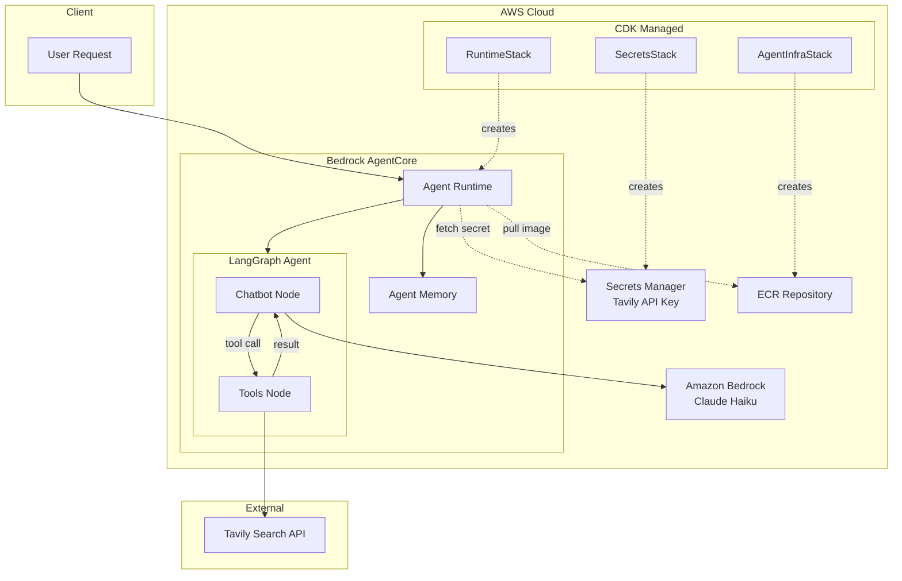
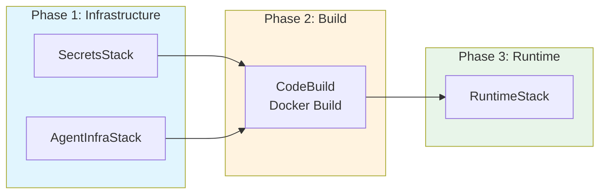

# LangGraph Agent on AWS Bedrock AgentCore

A sample LangGraph agent with web search capabilities deployed to AWS Bedrock AgentCore. This project demonstrates how to build and deploy a LangGraph-based AI agent with full observability (LLM calls, tool calls, and timing metrics) using AWS native tooling.

## What This Project Does

This agent:

- Uses **Claude Haiku** (via Amazon Bedrock) as the LLM
- Performs **web searches** using the Tavily API
- Runs on **AWS Bedrock AgentCore** with container deployment
- Provides **full observability** via OpenTelemetry instrumentation (LangChain traces, LLM latency, tool execution times)

## Architecture



The agent uses a ReAct-style graph where the **Chatbot Node** invokes Claude Haiku, and if a tool call is requested, the **Tools Node** executes the Tavily search and returns results back to the chatbot.

> **Deep Dive:** See [Infrastructure as Code](#infrastructure-as-code) for detailed CDK stack documentation.

## Prerequisites

**Supported platforms:**

- **macOS** - Fully supported
- **Linux** - Fully supported
- **Windows** - Use [WSL (Windows Subsystem for Linux)](https://learn.microsoft.com/en-us/windows/wsl/install). Native Windows (PowerShell/CMD) is not supported due to Makefile and shell command dependencies.

**Local tools:**

- **Python 3.13+**
- **uv** - Fast Python package manager. Install with `curl -LsSf https://astral.sh/uv/install.sh | sh`
- **Node.js** - Required for AWS CDK CLI
- **make** - Pre-installed on macOS/Linux. On WSL, install with `sudo apt install make`

**AWS tools:**

- **AWS CLI** - Configured with credentials (default profile or named profile)
- **AWS CDK CLI** - Install with `npm install -g aws-cdk`

**Accounts & API keys:**

- **AWS Account** with permissions for Bedrock AgentCore, IAM, ECR, S3, CodeBuild, Secrets Manager, CloudWatch Logs, and CloudFormation
- **Tavily API Key** - Get one at <https://tavily.com>

> **Note on AWS Credentials:** Commands below show two options:
>
> - **Default credentials**: Use if you have `~/.aws/credentials` configured or are using environment variables
> - **Named profile**: Use if you have SSO or multiple profiles configured (replace `YourProfileName` with your profile)

## Setup

### 1. Clone the Repository

```bash
git clone <repository-url>
cd langgraph-to-agentcore-sample
```

### 2. Install Dependencies (Optional)

This project uses [uv](https://docs.astral.sh/uv/) for fast, reliable dependency management. Each `make` command automatically installs its required dependencies, so you can skip this step and jump straight to configuration.

```bash
# Install ALL dependencies upfront (local, deploy, ui)
make setup

# Or just run commands directly - they self-install what they need
make local    # installs local deps
make deploy   # installs deploy deps
make ui       # installs ui + deploy deps
```

> **Note:** No need to manually activate a virtual environment. Use `uv run <command>` or `make <target>` to run commands with the correct environment.

### 3. Configure Environment Variables

This project separates configuration from secrets for better security:

- **`.env`** - Non-sensitive configuration (region, model IDs, agent name)
- **`.secrets`** - Sensitive values like API keys (never committed to git)

Create both files from the samples:

```bash
cp .env.sample .env
cp .secrets.sample .secrets
```

Edit `.env` with your deployment configuration:

```bash
# Deployment Configuration
AWS_REGION=us-east-2
AGENT_NAME=langgraph_agent_web_search
MODEL_ID=global.anthropic.claude-haiku-4-5-20251001-v1:0
FALLBACK_MODEL_ID=global.anthropic.claude-sonnet-4-5-20250929-v1:0
SECRET_NAME=langgraph-agent/tavily-api-key
```

Edit `.secrets` with your API keys:

```bash
# Sensitive credentials - never commit this file!
TAVILY_API_KEY=your-tavily-api-key-here
```

**Configuration variables (`.env`):**

| Variable            | Description                                                              |
| ------------------- | ------------------------------------------------------------------------ |
| `AWS_REGION`        | AWS region for deployment (default: `us-east-2`)                         |
| `AGENT_NAME`        | Name for your agent in AgentCore (keep under 25 chars to avoid AWS limits) |
| `MODEL_ID`          | Primary Bedrock model ID (default: Haiku)                                |
| `FALLBACK_MODEL_ID` | Fallback model when primary is unavailable (default: Sonnet)             |
| `SECRET_NAME`       | Name for the Secrets Manager secret                                      |

**Secrets (`.secrets`):**

| Variable         | Description                    |
| ---------------- | ------------------------------ |
| `TAVILY_API_KEY` | Your Tavily API key (required) |

### 4. Ensure AWS Credentials are Active

```bash
# For SSO profiles
aws sso login --profile YourProfileName

# For default credentials, verify with:
aws sts get-caller-identity
```

## Running Tests

Before deploying, run the test suite to verify everything works:

```bash
# Using Makefile (recommended)
make test          # Run all tests
make test-cov      # Run with coverage report

# Or using uv directly
uv run pytest tests/ -v
```

The test suite includes:

- **Agent tests** (`tests/test_agent.py`): Tests for secret fetching, payload handling, resilience logic, and state management
- **Agent function tests** (`tests/test_agent_functions.py`): Unit tests for agent functions including chatbot node, invocation handling, and error cases
- **CDK tests** (`tests/test_cdk.py`): Infrastructure tests for Secrets Manager and IAM policy stacks

## AWS Profile Management

Many `make` commands require AWS credentials (for Bedrock, deployment, etc.). You can set your AWS profile once and it will be used for all subsequent commands:

```bash
# Set your profile once
make set-profile PROFILE=YourProfile

# Now all commands use it automatically
make local
make deploy
make invoke

# Override for a single command if needed
make deploy PROFILE=DifferentProfile

# Clear the saved profile
make clear-profile
```

The profile is saved to `.aws-profile` (gitignored). If no profile is set, commands use your default AWS credentials.

## Local Testing (Without Deploying)

Test your agent locally before deploying to AWS using the AgentCore development server:

### Start Local Server

```bash
make local
```

This starts a local server on `http://localhost:8080` that mimics the AgentCore Runtime environment.

### Invoke Locally

In a separate terminal:

```bash
make local-invoke PROMPT="What is AWS Lambda?"
```

### Requirements

- Set `TAVILY_API_KEY` in your `.secrets` file (the agent reads it automatically)
- AWS credentials for Bedrock access (see [AWS Profile Management](#aws-profile-management))

### Benefits

| Benefit | Description |
|---------|-------------|
| **Fast iteration** | No need to build container or deploy to AWS |
| **Same runtime behavior** | Local server mimics AgentCore Runtime |
| **Debug easily** | Full access to logs and stack traces |

> **Note:** The `bedrock-agentcore-starter-toolkit` is installed as a local-only dependency and is NOT included in the deployed Docker container.

## Deployment

### Using the Deploy Script (Required)

The deployment script is **required** because it passes runtime environment variables to the AgentCore container via `--env` flags. Without this step, the agent would use hardcoded defaults instead of your `.env` configuration.

```bash
# Using Makefile (recommended)
make deploy

# Or using uv directly
uv run python -m scripts.deploy
```

> **Tip:** Set your AWS profile once with `make set-profile PROFILE=YourProfile`. See [AWS Profile Management](#aws-profile-management).

**What the script does:**

| Step | Action                                                                                    |
| ---- | ----------------------------------------------------------------------------------------- |
| 1/3  | **CDK Infrastructure** - Deploys SecretsStack + AgentInfraStack (ECR, CodeBuild, IAM, Memory) |
| 2/3  | **CodeBuild** - Triggers build to create Docker image and push to ECR                     |
| 3/3  | **CDK RuntimeStack** - Creates AgentCore Runtime with container and environment config    |

> **All infrastructure is CDK-managed.** See [Infrastructure as Code](#infrastructure-as-code) for detailed stack documentation.
>
> **First-time setup:** The deploy script automatically bootstraps CDK if needed (one-time per account/region).

### Manual Deployment (Advanced)

<!-- markdownlint-disable MD033 -->
<details>
<summary>Click to expand manual CDK deployment steps</summary>
<!-- markdownlint-enable MD033 -->

> **Note:** These steps mirror what `make deploy` does automatically. Using `make deploy` is recommended.

#### 1. Bootstrap CDK (first-time only)

```bash
cd cdk && cdk bootstrap aws://ACCOUNT_ID/REGION --profile YourProfileName
```

#### 2. Deploy Infrastructure Stacks

Deploy SecretsStack and AgentInfraStack (can run in parallel):

```bash
cd cdk && cdk deploy SecretsStack AgentInfraStack \
  --require-approval never \
  --outputs-file cdk-outputs.json \
  --context secret_name="langgraph-agent/tavily-api-key" \
  --context tavily_api_key="your-tavily-api-key" \
  --context agent_name="your_agent_name" \
  --context model_id="global.anthropic.claude-haiku-4-5-20251001-v1:0" \
  --context fallback_model_id="global.anthropic.claude-sonnet-4-5-20250929-v1:0" \
  --context source_path=".." \
  --profile YourProfileName
```

#### 3. Build and Push Docker Image

Trigger the CodeBuild project created by AgentInfraStack:

```bash
aws codebuild start-build \
  --project-name your_agent_name-builder \
  --profile YourProfileName

# Wait for build to complete
aws codebuild batch-get-builds --ids BUILD_ID --profile YourProfileName
```

#### 4. Deploy Runtime Stack

Once the Docker image is in ECR, deploy the RuntimeStack:

```bash
cd cdk && cdk deploy RuntimeStack \
  --require-approval never \
  --context secret_name="langgraph-agent/tavily-api-key" \
  --context agent_name="your_agent_name" \
  --context model_id="global.anthropic.claude-haiku-4-5-20251001-v1:0" \
  --context fallback_model_id="global.anthropic.claude-sonnet-4-5-20250929-v1:0" \
  --context source_path=".." \
  --profile YourProfileName
```

</details>

## Testing the Deployed Agent

### Web UI (Recommended)

A NiceGUI-based web interface is available for testing the deployed agent with multiple prompts concurrently:

```bash
# Launch the testing UI
make ui
```

Then open <http://localhost:8080> in your browser.

**Features:**

| Feature | Description |
|---------|-------------|
| **Prompt Library** | Pre-configured library of 15 test prompts across different categories |
| **Concurrent Execution** | Run multiple prompts in parallel (configurable 1-10 concurrent) |
| **AWS Profile Selection** | Dropdown populated from `~/.aws/config` |
| **Real-time Progress** | Live progress bar and status counters |
| **Results View** | Expandable results with full response text |
| **CSV Export** | Export all results to CSV for analysis |
| **CRUD Operations** | Add, edit, and delete prompts from the library |

**Screenshot:**


**Prompt Storage:** Prompts are stored in `ui/prompts.json` and persist across sessions.

### Invoke the Agent

```bash
# Using Makefile (recommended)
make invoke                          # Default prompt
make invoke PROMPT="Your question"   # Custom prompt

# Using uv directly
uv run agentcore invoke '{"prompt": "Search for AWS news today"}'
```

### View Logs

Stream agent runtime logs with pretty formatting:

```bash
# Using Makefile (recommended) - streams with color-coded output
make logs

# Logs are formatted with:
# - Color-coded severity levels (INFO=blue, WARN=yellow, ERROR=red)
# - Clean timestamps (HH:MM:SS.mmm format)
# - Trace IDs for correlation
# - File locations for errors/warnings
```

**Example output:**

```text
📋 Agent Runtime Logs (press Ctrl+C to stop)
────────────────────────────────────────────────────────────────────────────────

17:23:01.236 INFO  Agent invocation started with prompt length: 25 [trace:695fe7f4]
17:23:01.238 INFO  Chatbot node invoked with 1 messages [trace:695fe7f4]
17:23:03.347 INFO  LLM response received, has tool calls: False [trace:695fe7f4]
17:23:03.348 INFO  Agent invocation completed successfully [trace:695fe7f4]
17:23:03.349 INFO  Invocation completed successfully (2.113s) [trace:695fe7f4]
```

### Check Agent Status

```bash
# Using Makefile
make status

# Using uv directly
uv run agentcore status
```

## Observability

This project uses OpenTelemetry instrumentation to capture LangChain traces. The container deployment uses the `opentelemetry-instrument` wrapper which auto-instruments:

- **LangChain/LangGraph** operations (chains, tools, routing)
- **Bedrock Runtime** API calls (LLM invocations)
- **Botocore** AWS SDK calls

### View Traces

Analyze OpenTelemetry traces from recent agent invocations:

```bash
# Using Makefile (default: last 1 hour)
make traces

# View traces from last 2 hours
make traces HOURS=2

# View traces from last 24 hours
make traces HOURS=24
```

**Example output:**

```text
🔍 Analyzing traces for agent: langgraph_search_8Jan (langgraph_search_8Jan-SggTzr89De)
   Time range: Last 1 hour(s)

Total log events: 142

Unique trace IDs found: 3
  - Trace ID: 695fd2850719b999273b98a51413fa9c
    Events: 9
    Time range: 2026-01-08 09:51:33.879000 to 2026-01-08 09:51:39.685000
    Duration: 5.806s (5806ms)
  - Trace ID: 695fd2bd64184b49549ac281325749c3
    Events: 9
    Time range: 2026-01-08 09:52:29.677000 to 2026-01-08 09:52:35.325000
    Duration: 5.648s (5648ms)
  - Trace ID: 695fe17016144f85065bbaa7691341d4
    Events: 9
    Time range: 2026-01-08 10:55:13.581000 to 2026-01-08 10:55:19.017000
    Duration: 5.436s (5436ms)
```

**Trace features:**

- Unique trace IDs for each agent invocation
- Event counts (typically 9-12 events per invocation)
- Full execution timeline with start/end timestamps
- Total duration in seconds and milliseconds
- Configurable time range (HOURS parameter)

### CloudWatch Dashboard

View the GenAI Observability Dashboard in the AWS Console:

```text
https://console.aws.amazon.com/cloudwatch/home?region=<your-region>#gen-ai-observability/agent-core
```

## Infrastructure as Code

This project uses **AWS CDK (Python)** to manage all infrastructure declaratively. CDK provides version-controlled, reviewable infrastructure that integrates with your team's workflow.

### Why CDK?

| Benefit | Description |
|---------|-------------|
| **Type Safety** | Python stacks with IDE autocomplete and validation |
| **Modular Stacks** | Separate stacks for secrets, infrastructure, and runtime |
| **Cross-Stack References** | Resources automatically wired between stacks |
| **Drift Detection** | CloudFormation tracks actual vs. desired state |
| **Rollback Support** | Failed deployments automatically roll back |

### CDK Stacks

The infrastructure is organized into three stacks that deploy in a specific order:



**Phase 1** deploys in parallel (no dependencies between SecretsStack and AgentInfraStack), **Phase 2** runs CodeBuild to push the Docker image, and **Phase 3** creates the Runtime (which requires the image to exist).

### Stack Details

#### SecretsStack

Creates the Tavily API key in AWS Secrets Manager.

| Resource | Type | Description |
|----------|------|-------------|
| `TavilyApiKey` | `secretsmanager.Secret` | Stores the Tavily API key securely |

**Outputs:** `SecretArn`, `SecretName`

#### AgentInfraStack

Creates all infrastructure required to build and run the agent.

| Resource | Type | Description |
|----------|------|-------------|
| `AgentECR` | `ecr.Repository` | Container registry for agent image |
| `SourceAsset` | `s3_assets.Asset` | Source code uploaded for CodeBuild |
| `CodeBuildRole` | `iam.Role` | IAM role for CodeBuild project |
| `AgentBuilder` | `codebuild.Project` | Builds Docker image and pushes to ECR |
| `ExecutionRole` | `iam.Role` | Runtime execution role with permissions |
| `AgentMemory` | `agentcore.CfnMemory` | Agent memory store for conversation history |

**Outputs:** `ECRRepositoryUri`, `CodeBuildProjectName`, `ExecutionRoleArn`, `MemoryArn`

**IAM Permissions granted to ExecutionRole:**

- `secretsmanager:GetSecretValue` - Fetch Tavily API key
- `bedrock:InvokeModel*` - Call Claude models
- `ecr:Get*`, `ecr:BatchGet*` - Pull container images
- `logs:CreateLog*`, `logs:PutLogEvents` - Write CloudWatch logs

#### RuntimeStack

Creates the AgentCore Runtime that runs the agent container.

| Resource | Type | Description |
|----------|------|-------------|
| `AgentRuntime` | `agentcore.CfnRuntime` | AgentCore runtime with container config |

**Outputs:** `RuntimeArn`, `RuntimeId`

**Environment variables passed to container:**

- `AWS_REGION` - Deployment region
- `SECRET_NAME` - Name of the Secrets Manager secret
- `MODEL_ID` - Primary Bedrock model ID
- `FALLBACK_MODEL_ID` - Fallback model for resilience

### CDK Project Structure

```text
cdk/
├── app.py                  # CDK app entry point
├── cdk.json                # CDK configuration
└── stacks/
    ├── __init__.py         # Stack exports
    ├── constants.py        # Shared constants (stack names, context keys)
    ├── secrets_stack.py    # SecretsStack definition
    ├── agent_infra_stack.py # AgentInfraStack definition
    └── runtime_stack.py    # RuntimeStack definition
```

### Manual CDK Commands

While `make deploy` handles everything automatically, you can run CDK commands directly:

```bash
# Synthesize CloudFormation templates (dry run)
cd cdk && cdk synth --all \
  --context secret_name="langgraph-agent/tavily-api-key" \
  --context tavily_api_key="your-key" \
  --context agent_name="your-agent" \
  --context model_id="..." \
  --context source_path=".."

# Deploy specific stacks
cdk deploy SecretsStack AgentInfraStack --profile YourProfile

# Show stack differences before deploying
cdk diff --profile YourProfile

# List all stacks
cdk ls
```

## Project Structure

```text
.
├── langgraph_agent_web_search.py  # Main agent code (includes resilience logic)
├── Makefile                       # Common development commands
├── pyproject.toml                 # Project metadata and dependencies
├── uv.lock                        # Locked dependencies (uv)
├── .env.sample                    # Configuration template (committed)
├── .env                           # Local configuration (gitignored)
├── .secrets.sample                # Secrets template (committed)
├── .secrets                       # Local secrets/API keys (gitignored)
├── .gitignore                     # Git ignore rules
├── scripts/                       # Deployment and observability scripts
│   ├── deploy.py                  # Deploy to AWS Bedrock AgentCore
│   ├── destroy.py                 # Cleanup AWS resources
│   ├── analyze_traces.py          # Analyze OpenTelemetry traces with durations
│   ├── format_logs.py             # Pretty-print CloudWatch logs with colors
│   └── lib/                       # Shared utilities
│       ├── aws.py                 # boto3 helpers (CloudFormation, Secrets, ECR)
│       ├── commands.py            # Subprocess wrappers (agentcore, cdk)
│       ├── config.py              # .env loading and validation
│       ├── console.py             # Colored output (Rich)
│       └── yaml_parser.py         # Parse .bedrock_agentcore.yaml
├── cdk/                           # AWS CDK infrastructure code
│   ├── app.py                     # CDK app entry point
│   ├── cdk.json                   # CDK configuration
│   └── stacks/                    # CDK stack definitions
│       ├── __init__.py            # Stack exports
│       ├── constants.py           # Shared constants (stack names, context keys)
│       ├── secrets_stack.py       # SecretsStack (Secrets Manager)
│       ├── agent_infra_stack.py   # AgentInfraStack (ECR, CodeBuild, IAM, Memory)
│       └── runtime_stack.py       # RuntimeStack (AgentCore Runtime)
├── ui/                            # NiceGUI testing web application
│   ├── app.py                     # Main application entry point
│   ├── prompts.json               # Prompt library storage (generated)
│   ├── components/                # UI components
│   │   ├── prompt_library.py      # Prompt list with CRUD
│   │   ├── execution_panel.py     # Run controls and progress
│   │   └── results_view.py        # Results table with export
│   └── lib/                       # Application logic
│       ├── models.py              # Data models (Prompt, Config, Result)
│       ├── prompt_store.py        # JSON-based prompt persistence
│       ├── agent_invoker.py       # Async agent invocation wrapper
│       └── aws_config.py          # AWS profile detection
├── tests/                         # Test suite
│   ├── test_agent.py              # Agent unit tests
│   ├── test_agent_functions.py    # Agent function unit tests
│   └── test_cdk.py                # CDK infrastructure tests
├── .bedrock_agentcore.yaml        # Agent configuration (generated)
└── .bedrock_agentcore/            # Build artifacts (generated)
    └── langgraph_agent_web_search/
        └── Dockerfile             # Container definition
```

## Key Dependencies

Dependencies are organized by purpose:

### Runtime Dependencies (Container)
These are packaged in the Docker container and deployed to AWS:

| Package                                   | Purpose                   |
| ----------------------------------------- | ------------------------- |
| `langgraph`                               | Agent graph framework     |
| `langchain` / `langchain-aws`             | LLM abstraction & Bedrock |
| `langchain-community` / `langchain-tavily`| Tavily search tool        |
| `bedrock-agentcore`                       | AgentCore runtime SDK     |
| `opentelemetry-instrumentation-langchain` | LangChain tracing         |
| `aws-opentelemetry-distro`                | AWS OTEL distribution     |

### Deployment Tools (Local Only)
Required for deploying infrastructure with CDK:

| Package         | Purpose                        |
| --------------- | ------------------------------ |
| `aws-cdk-lib`   | AWS CDK infrastructure library |
| `constructs`    | CDK constructs library         |
| `typer`         | CLI framework for scripts      |

Install with: `uv sync --extra deploy`

### Local Testing (Local Only)
Required for running the agent locally without deploying:

| Package                             | Purpose                    |
| ----------------------------------- | -------------------------- |
| `bedrock-agentcore-starter-toolkit` | Local dev server & CLI     |

Install with: `uv sync --extra local`

### Testing UI (Optional)
Web interface for testing deployed agents:

| Package   | Purpose                  |
| --------- | ------------------------ |
| `nicegui` | Web UI framework         |

Install with: `uv sync --extra ui`

### Development Tools
Code quality and testing:

| Package      | Purpose               |
| ------------ | --------------------- |
| `pytest`     | Testing framework     |
| `ruff`       | Linting and formatting|

Installed automatically with `uv sync`

## Makefile Commands

A Makefile is provided for common operations. Run `make help` to see all available targets. All commands use `uv` under the hood.

### AWS Profile

```bash
make set-profile PROFILE=YourProfile  # Save profile for all commands
make clear-profile                    # Clear saved profile
```

Once set, all commands automatically use your profile. See [AWS Profile Management](#aws-profile-management).

### Setup & Testing

```bash
make setup         # Install ALL dependencies (local, deploy, ui) - optional
make test          # Run all tests
make test-cov      # Run tests with coverage report
make lint          # Run linter and format check (ruff)
make format        # Format code and fix lint issues (ruff)
```

> **Note:** `make setup` is optional. Each command auto-installs its required dependencies.

### Local Testing

```bash
make local                        # Start local dev server
make local-invoke PROMPT="Hello"  # Invoke local server
```

### Deployment & Operations

```bash
make deploy      # Deploy agent to AWS
make destroy     # Destroy agent only (keeps secret and ECR)
make destroy-all # Destroy all resources including secret and ECR
```

### Runtime Commands

```bash
make status                 # Check agent status
make invoke                 # Test with default prompt
make invoke PROMPT="Hello"  # Test with custom prompt
make logs                   # Stream logs with pretty formatting (color-coded)
make traces                 # View traces (default: last 1 hour)
make traces HOURS=2         # View traces from last 2 hours
make ui                     # Launch web UI for testing (localhost:8080)
```

### Cleanup

```bash
make clean         # Remove build artifacts and cache files (.venv, __pycache__, cdk.out)
```

## Customizing the Agent

### Adding a New Tool

To add a new tool to the agent:

1. **Install the tool package** (if needed):

   ```bash
   uv add langchain-some-tool
   ```

2. **Import and configure the tool** in `langgraph_agent_web_search.py`:

   ```python
   from langchain_community.tools import SomeTool

   # After the Tavily search definition
   some_tool = SomeTool(param="value")
   tools = [search, some_tool]  # Add to tools list
   ```

3. **Redeploy**:

   ```bash
   make deploy
   ```

### Changing the LLM Model

Update `MODEL_ID` and `FALLBACK_MODEL_ID` in `.env` to use different Bedrock models:

```bash
# Primary model (default: Haiku - faster, lower cost)
MODEL_ID=global.anthropic.claude-haiku-4-5-20251001-v1:0

# Fallback model (default: Sonnet - used when primary is unavailable)
FALLBACK_MODEL_ID=global.anthropic.claude-sonnet-4-5-20250929-v1:0
```

**Model Fallback Behavior:**

- The agent retries the primary model up to 3 times with exponential backoff on throttling/service errors
- If retries are exhausted, it automatically falls back to the secondary model
- Both models have the same tools bound for consistent behavior

**Error Handling Strategy:**

| Error Type | Behavior | Rationale |
|------------|----------|-----------|
| `ThrottlingException` | Retry 3x with backoff | Temporary rate limit, may clear |
| `ServiceUnavailable` | Retry 3x with backoff | Transient service issue |
| `InternalFailure` | Retry 3x with backoff | Transient server error |
| `ServiceQuotaExceededException` | Immediate fallback | Quota exhausted, won't recover soon |
| `ModelNotReadyException` | Immediate fallback | Model unavailable in region |
| `ModelTimeoutException` | Immediate fallback | Model overloaded |
| `AccessDeniedException` | Fail (no fallback) | IAM issue, fallback would fail too |
| `ValidationException` | Fail (no fallback) | Bad input, would fail on any model |

### Adjusting Search Results

Modify `max_results` in `langgraph_agent_web_search.py`:

```python
search = TavilySearchResults(max_results=5)  # Default is 3
```

## Cost Estimation

Running this agent incurs costs from multiple AWS services:

| Service | Cost Factor | Estimate |
|---------|-------------|----------|
| **Bedrock (Claude Haiku)** | ~$0.25/1M input tokens, ~$1.25/1M output tokens | ~$0.001-0.01 per invocation |
| **Tavily API** | Free tier: 1000 searches/month | $0 (free tier) or $50+/month |
| **AgentCore Runtime** | Compute time | Varies by usage |
| **Secrets Manager** | $0.40/secret/month + $0.05/10K API calls | ~$0.50/month |
| **ECR** | $0.10/GB/month storage | ~$0.05/month |
| **CloudWatch Logs** | $0.50/GB ingested | ~$0.10/month (low usage) |

**Estimated monthly cost for light usage (100 invocations/month):** $1-5

> **Tip:** Use `make traces` to monitor invocation patterns and track execution durations for cost optimization.

## Security Considerations

### Secrets Management

- **API keys** are stored in AWS Secrets Manager, not in code or environment variables
- The agent fetches secrets at runtime using IAM role permissions
- Secrets have `RETAIN` removal policy to prevent accidental deletion

### IAM Least Privilege

- The execution role only has `secretsmanager:GetSecretValue` permission
- Access is scoped to the specific secret ARN (no wildcards)
- CDK validates ARN formats before deployment

### Network Security

- Agent runs in AWS-managed VPC (AgentCore infrastructure)
- Outbound internet access required for Tavily API calls
- All AWS API calls use HTTPS

### Container Security

- Container images are stored in ECR but **not actively scanned** for vulnerabilities
- Enable ECR scanning for production deployments (see command below)
- For continuous scanning, consider enabling [Amazon Inspector](https://docs.aws.amazon.com/inspector/latest/user/scanning-ecr.html) enhanced scanning

```bash
# Enable scan-on-push for the agent's ECR repository
aws ecr put-image-scanning-configuration \
    --repository-name bedrock-agentcore-<agent_name> \
    --image-scanning-configuration scanOnPush=true \
    --region <your-region>
```

### Recommendations

1. **Rotate secrets regularly** using Secrets Manager rotation
2. **Monitor CloudWatch logs** for unusual activity
3. **Use separate AWS accounts** for dev/staging/production
4. **Enable CloudTrail** to audit API calls

## Cleanup

Use the cleanup script to destroy AWS resources:

```bash
# Using Makefile (recommended)
make destroy     # Destroy agent only (keeps secret and ECR)
make destroy-all # Destroy everything

# Or using uv directly
uv run python -m scripts.destroy       # Destroy agent only
uv run python -m scripts.destroy --all # Destroy everything

# Selective deletion flags
uv run python -m scripts.destroy --delete-secret              # Also delete Secrets Manager secret
uv run python -m scripts.destroy --delete-ecr                 # Also delete ECR repository
uv run python -m scripts.destroy --delete-secret --delete-ecr # Same as --all
```

**What gets deleted:**

Since all resources are CDK-managed, `cdk destroy --all` removes everything:

| Stack | Resources Removed |
|-------|-------------------|
| `RuntimeStack` | AgentCore Runtime |
| `AgentInfraStack` | ECR repository, CodeBuild project, IAM execution role, Agent Memory, S3 source assets |
| `SecretsStack` | Secrets Manager secret |

> **Note:** The ECR repository is configured with `empty_on_delete=True` and `removal_policy=DESTROY`, so images are automatically deleted when the stack is destroyed.

## Troubleshooting

### "agentcore command not found"

Use `uv run` or `make` to run commands with the correct environment:

```bash
# Using make (recommended) - auto-installs dependencies
make status

# Or using uv directly
uv run agentcore status
```

> **Tip:** Ensure your AWS profile is set with `make set-profile PROFILE=YourProfile`.

### "Missing .secrets file" error during deployment

Create the `.secrets` file from the template:

```bash
cp .secrets.sample .secrets
```

Then edit `.secrets` and add your Tavily API key.

### Agent fails to start with "TAVILY_API_KEY not found" (runtime)

This error occurs when the deployed agent can't retrieve the secret from AWS. Ensure:

1. The secret exists in Secrets Manager with the correct name (check `SECRET_NAME` in `.env`)
2. The execution role has the `SecretsManagerAccess` policy attached

### Traces not appearing in `make traces`

1. Wait 1-2 minutes after invocation for traces to propagate to CloudWatch Logs
2. Verify deployment type is `container` (not `direct_code_deploy`)
3. Try increasing the time range: `make traces HOURS=2`
4. Check that OpenTelemetry instrumentation is working: `make logs` should show trace IDs

### CodeBuild fails

Check CodeBuild logs in the AWS Console:

1. Go to **AWS CodeBuild** > **Build projects**
2. Find the project named `bedrock-agentcore-<agent-name>-builder`
3. Click on the failed build to view logs

### CDK deployment fails

If you see CDK-related errors:

1. **"CDK CLI not found"** - Install with `npm install -g aws-cdk`
2. **Bootstrap errors** - The deploy script auto-bootstraps, but you can manually run: `cdk bootstrap aws://ACCOUNT_ID/REGION`
3. **Permission errors** - Ensure your AWS credentials have CloudFormation permissions

### Agent name too long warning

If you see a `ValidationException` about name length during deployment:

```text
Value '...-traces-destination' at 'name' failed to satisfy constraint: Member must have length less than or equal to 60
```

This means your `AGENT_NAME` is too long. AWS appends suffixes like `_mem-XXXXXXXXXX-traces-destination` to your agent name, and the combined string must be under 60 characters. Keep your agent name under 25 characters to avoid this issue.

## References

- [Amazon Bedrock AgentCore Documentation](https://docs.aws.amazon.com/bedrock-agentcore/)
- [LangGraph Documentation](https://langchain-ai.github.io/langgraph/)
- [Tavily API](https://tavily.com)
- [AWS Bedrock AgentCore Samples](https://github.com/awslabs/amazon-bedrock-agentcore-samples)
- [uv - Fast Python Package Manager](https://docs.astral.sh/uv/)
